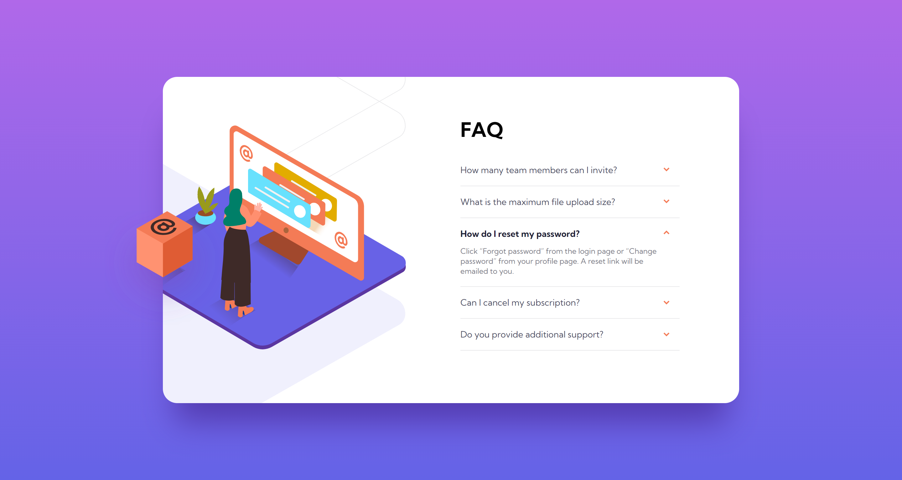
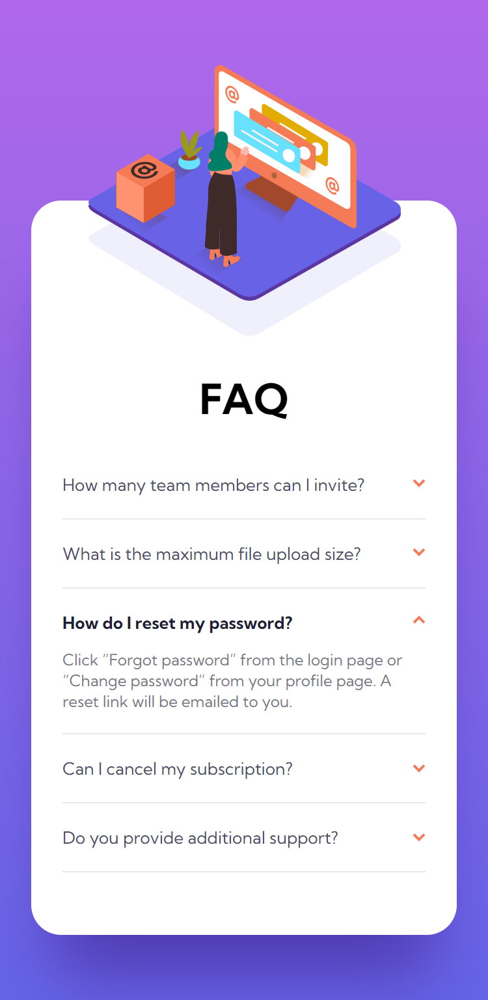

 <h1>FAQ  accordion card</h1>

This is my next solution to frontend mentor challenges.

[Live URL](https://ivaberiashvili.github.io/faq-accordion-card/) | [Solution]() | [Challenge on Frontend Mentor](https://www.frontendmentor.io/challenges/faq-accordion-card-XlyjD0Oam)
:-------------------------:|:-------------------------:|:-------------------------:

## The challenge

Users should be able to:

- View the optimal layout for the component depending on their device's screen size
- See hover states for all interactive elements on the page
- Hide/Show the answer to a question when the question is clicked

## The Solution
Desktop             |  Mobile
:-------------------------:|:-------------------------:
  |  

### Built with

- Semantic HTML5 markup
- CSS
- Mobile-first workflow
- Vanilla JS

### Author
- [Iva](https://github.com/ivaberiashvili/)

